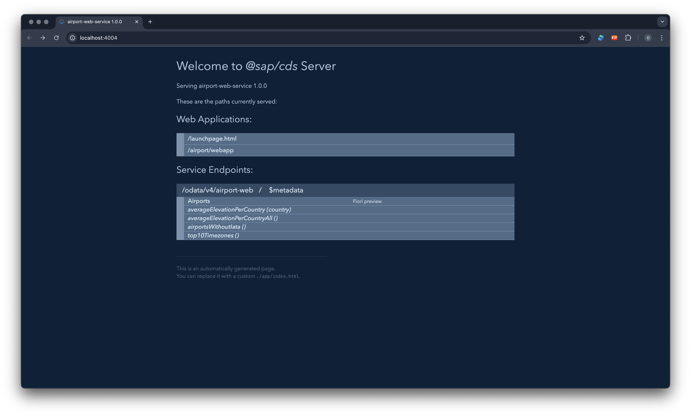
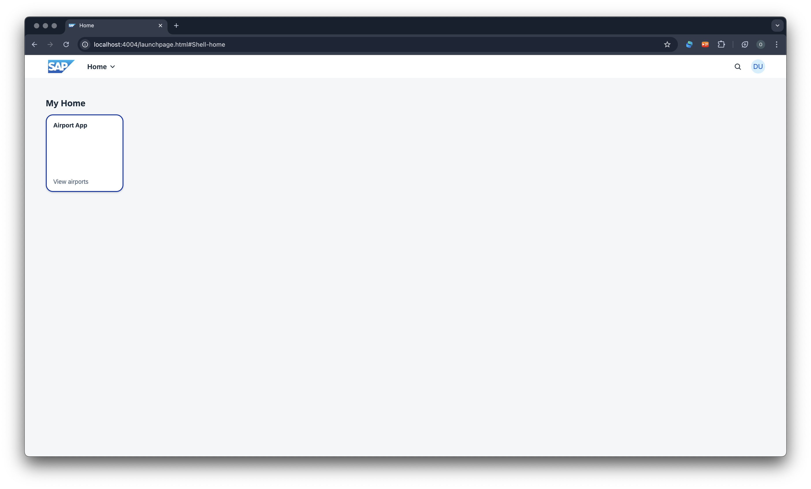
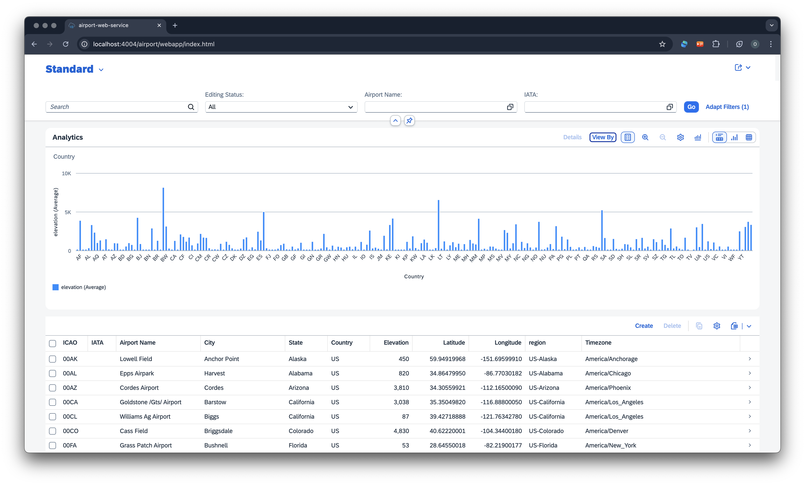
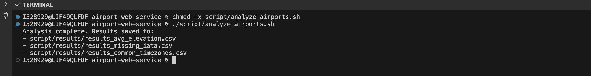
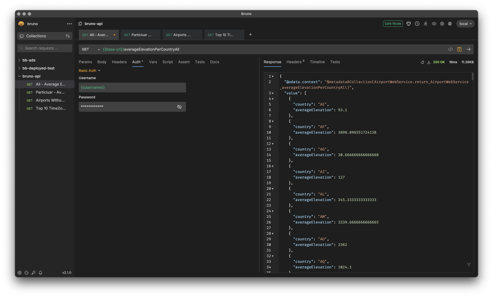
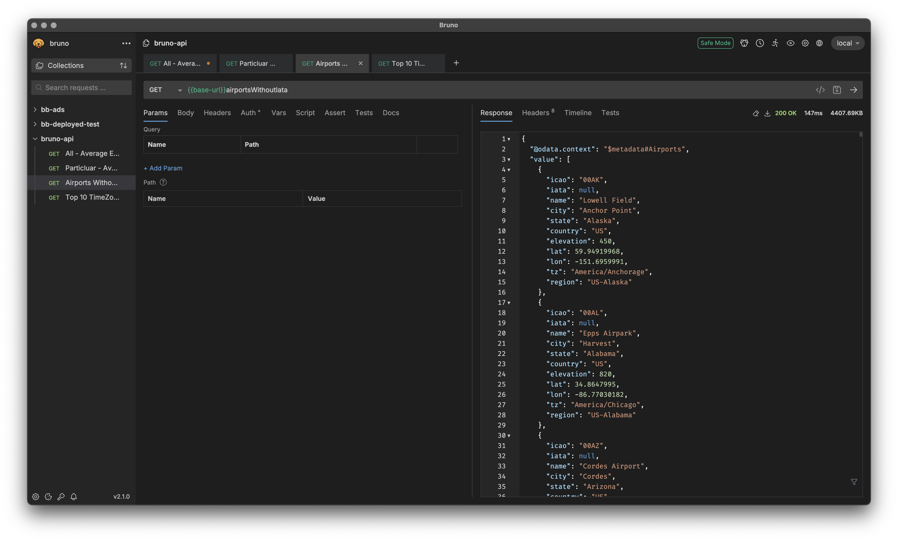
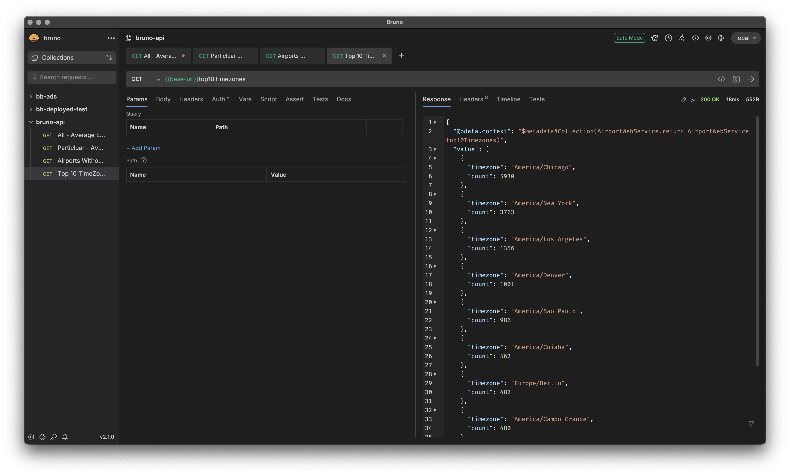
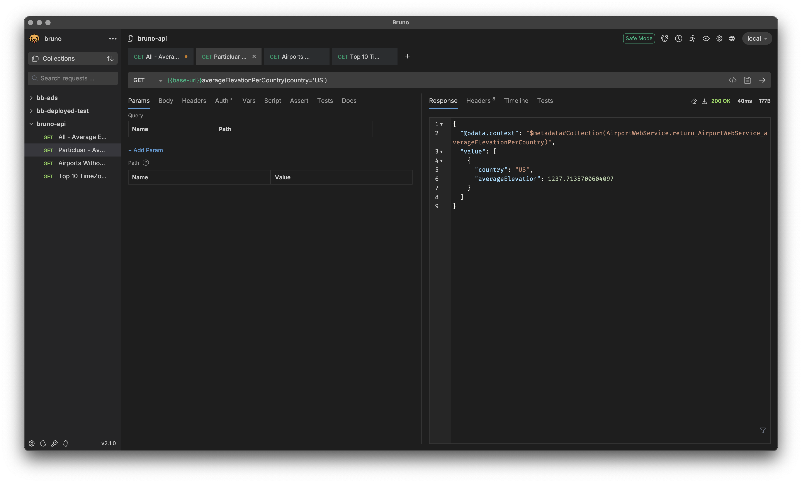

# Coding Exercise for Platform CoE Hiring

This web application is built using **CAP (Core Data and Services)** on **Node.js** with **Fiori Elements** for the UI. It provides functionality to manage airport data, including retrieval, sorting, filtering, dynamic additions, and displaying the data in a user-friendly interface. The application includes basic authentication, authorization, and testing.

---

## Application Development Tasks

1. Build a web service that offers an endpoint which returns all airports from either the JSON or CSV file.
2. Enhance the service by adding a derived field like `region` (e.g., `"US-Wisconsin"` from country and state).
3. Add capability to sort by name, city, state, or country in ascending or descending order.
4. Add a feature to filter airports by name using a `contains` filter.
5. Create an endpoint to add a new airport (name, city, state, etc.) during runtime.
6. Create a UI that loads the full dataset from the service and shows it in a table with all columns.
7. Improve the UI by highlighting rows of airports having elevation over **8000 feet**.
8. Write unit tests and deploy your application to **BTP** (Optional).

---

## Scripting Tasks

1. Calculate average elevation per country.
2. Find airports without IATA codes.
3. Determine the 10 most common time zones.

---

## Requirements & Prerequisites

Before running the application, ensure you have the following installed:

- Node.js and npm (Node Package Manager)
- CAP CLI
- Fiori Elements
- IDE (Business Application Studio, VS Code, or any other of your choice)

For detailed setup instructions, refer to the [Local Development Setup](https://github.tools.sap/sapit-cloud-samples/backlog-management/wiki/%22Pre-Read%22-for-Participants#local-development-setup)

---

## Installation and Setup

1. **Clone the Repository**  
```bash
git clone <repo-url>
```

2. **Open the Repository**  
Open the cloned repository in your preferred IDE.

3. **Install Dependencies**  
```bash
npm install
# If issues occur, try:
npm install --force
```

4. **Deploy to SQLite Database**  
```bash
cds deploy
```

5. **Start the Service**  
```bash
cds watch
```

---

## Run Tests

```bash
npm run test
```

---

## Accessing the Application

### Web Service
Navigate to: [http://localhost:4004/](http://localhost:4004/)  

**Note on Authorization:** When you access the web app for the first time, you will encounter an authorization prompt. Refer to the `package.json` file under the `auth` field to find the required username and password for access.

### Web Applications
- Navigate to [http://localhost:4004/airport/webapp/index.html](http://localhost:4004/airport/webapp/index.html) – for Full dataset table and Analytics table
- Navigate to [http://localhost:4004/launchpage.html](http://localhost:4004/launchpage.html) – for Tile page view  

### Service Endpoints
- **All airports:**  
  [http://localhost:4004/odata/v4/airport-web/Airports](http://localhost:4004/odata/v4/airport-web/Airports)  
- **Average elevation per country:**  
  [http://localhost:4004/odata/v4/airport-web/averageElevationPerCountryAll](http://localhost:4004/odata/v4/airport-web/averageElevationPerCountryAll)  
- **Airports without IATA codes:**  
  [http://localhost:4004/odata/v4/airport-web/airportsWithoutIata](http://localhost:4004/odata/v4/airport-web/airportsWithoutIata)  
- **Top 10 time zones:**  
  [http://localhost:4004/odata/v4/airport-web/top10Timezones](http://localhost:4004/odata/v4/airport-web/top10Timezones)
- **Average elevation per country(country='US'):**  
  [http://localhost:4004/odata/v4/airport-web/averageElevationPerCountry](http://localhost:4004/odata/v4/airport-web/averageElevationPerCountry)  - *for particular country*

---

## Screenshots

### Web Service Page

**

### Web Application (UI)

**

**

---

## Run Bash Script

1. In the root directory, there is a `script` folder containing `analyze_airports.sh`. This script provides an alternative way to get results for the scripting tasks.

2. First, make the file executable. While in the root directory, run the following command:

```bash
chmod +x script/analyze_airports.sh
```

3. Now, execute the script to get the results:

```bash
./script/analyze_airports.sh
```

**Execution:**  
**

---

## Running API Scripts with Bruno

- **Use the Bruno API collection to get the results**

1. **Prerequisite:** Install Bruno  
2. **Import the collection:** `bruno-api.json` from the `bruno-api` folder  
3. **Set the environment:** Choose the local environment  
4. **Authorization Note:** If you face any issues with authorization, set the username and password as specified in `package.json`

**Run all the API endpoints to get the results:**

- **Calculate Average Elevation per Country:**  
  **

- **Find Airports Without IATA Codes:**  
  **

- **Determine the 10 Most Common Time Zones:**  
  **

- **Calculate Average Elevation per Country** *(for a particular country)*  
  **

---

## Learn More

To learn more about CAP, visit:  
[https://cap.cloud.sap/docs/get-started/](https://cap.cloud.sap/docs/get-started/)

---

**PEACE**
